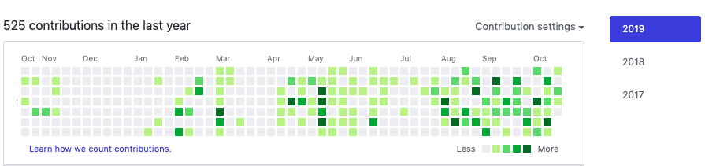
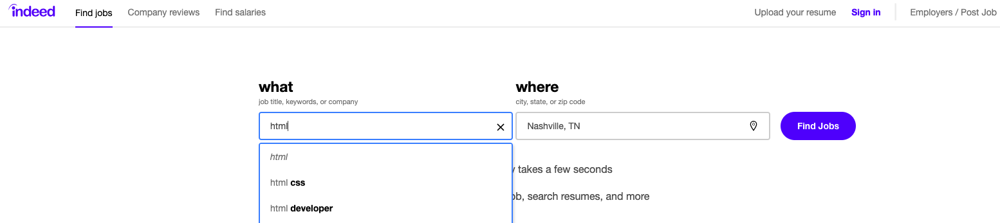

# Career Connection

## Career Connection

Welcome to your first Career Connection! In each unit of this course, Career Connections will review real-world applications for the material covered, preparing you to be tested on your new knowledge in technical interviews and equipping you with strategies to become employer-competitive.

We've consulted many employers to learn what will help applicants stand out from the crowd. With that knowledge, we'll suggest steps that you can take every week to reach that point.

### Becoming Employer-Competitive

Here at Career Services, we often refer to two job-preparedness levels: **employer-ready** and **employer-competitive**. Let's review what these terms mean:

* **Employer-ready** means that you meet the minimum requirements to apply for a developer job. You have strong, complete job search materials (such as a resume, portfolio, and LinkedIn profile). With some luck, an employer might notice your application and decide that you fit their needs.

* **Employer-competitive** means that you've given yourself the best chance to secure your desired job. You've compiled excellent job search materials, you know how to prepare for interviews, and you use multiple networking strategies to proactively seek and pursue the jobs you want. 

    > **Deep Dive:** To learn more about becoming employer-competitive, see this [Intro to Career Services](https://sites.google.com/2u.com/careerservices-webdev/coding-milestones/intro-to-career-services). 

Most of the students who work with Career Services to become employer-competitive find employment within six months after graduation! 

Becoming employer-competitive requires that you start now to position yourself as a developer, think like a developer, and engage with the online development community. Ready to get started? Complete the following three steps, and you’ll be that much closer to acing the job interview when the time comes.

#### Step #1: Discover What's Out There

Peruse open source projects to discover what other developers are building. Pay attention to what others write in their commit messages. You can start by reviewing the following projects on GitHub:

* [ChartJS](https://github.com/chartjs/Chart.js)

* [D3js](https://github.com/d3/d3)

* [Flux](https://github.com/facebook/flux)

#### Step #2: Learn How to Market Yourself

Browse professionally designed websites and apps for inspiration as you prepare to build a portfolio. The following links provide numerous examples of style and layout:

* [10 Fantastic Portfolio Websites from Silicon Valley Design Leads](https://medium.com/@bestfolios/10-fantastic-portfolio-websites-from-silicon-valley-design-leads-2d84b384dba6)

* [One Page Love](https://onepagelove.com/inspiration/portfolio)

* [10 Awesome Web Developer Portfolios](https://codeburst.io/10-awesome-web-developer-portfolios-d266b32e6154)

#### Step #3: Code a Lot&mdash;and Put It All on GitHub

Many companies will ask you to pair-program with one of their developers during an interview, so practice this skill with a friend or classmate. Also, because GitHub makes it easy for employers to check your commit history, make sure that both you and your partner commit to GitHub regularly. Don’t forget to keep your commit messages clean and professional!

Review your own code commit chart periodically to see how you appear to employers. The following image shows an example of a commit chart:

In this chart, each green box represents a time when a commit was made. The darker green indicates more commits. Big gray spaces look bad to prospective employers, while lots of green boxes indicate high activity levels.

### Look to the Future

Git, HTML, and CSS are fundamental to any web application that you develop, so you’re already on your way to becoming a junior web developer! 

At some point, you might want to advance to the role of senior developer or principal developer&mdash;or maybe even chief technology officer. Senior developers work on complex projects with a variety of technologies and tools. To prepare for this as, use plenty of tools and methodologies from current real-world projects as you learn to code.

But it all begins with HTML, CSS, and Git. Though it's unlikely that you'll ever interview specifically for an HTML job, you'll almost definitely face questions about HTML and CSS during the interview process. Start practicing these skills now.

Complete the following steps to start familiarizing yourself with the job market.

#### Step #1: Investigate Developer Job Listings

[Indeed.com](https://www.indeed.com/) is a great resource for finding a variety of job postings. Visit the website and search for jobs that use HTML, CSS, and Git.

The following image shows what that search might look like:

Review the search results for each category. Then write your answers to the following questions:

* **Where do HTML, CSS, and Git typically appear in the job description?**

    You might find the terms listed with other technologies under a heading like Skills Required, Tech Stack, or something similar. These lists can be intimidating, but think of them as wish lists&mdash;most companies know that they won’t get everything they want. Don’t be afraid to apply for jobs where you only know 60% or 70% of the required technologies. Employers are also looking for that all-important **cultural fit**, meaning that they want someone who will work well with the team. Technical skills can be taught, but cultural fit can't be.

* **What other skills are listed alongside HTML, CSS, and Git?**

    Besides HTML, CSS, and Git, you might see JavaScript, object-oriented design, SQL, MongoDB, Bootstrap, Rest, JSON, or React. By the end of this course, you'll possess these skills too. You might see some technologies listed&mdash;like ASP.NET, Spring, Angular, or VueJS&mdash;that aren't covered in this course. Yet the skills you'll learn transfer directly to these other technologies. They aren't all that different, anyway!

* **What level of experience, in years, are employers typically looking for?**

    You’ll notice that almost all job postings specify at least two to three years of development experience. Those looking for senior developers will call for five to eight years minimum. Again, treat these requests like a wish list. If you see a job posting along the lines of “front-end developer, two years experience,” you can and should apply for that job.

#### Step #2: Add Technical Skills to Your Resume

Before you move on to the next module, make sure to add HTML, CSS, and Git to the Technical Skills list on your resume. This will help you pass those pesky automated resume scanners and will indicate to potential employers that you have the skills they need.

> **Deep Dive:** To learn more, refer to the [Develop Your Resume milestone page](https://sites.google.com/2u.com/careerservices-webdev/coding-milestones/milestone-develop-your-resume).

### Prepare for the Technical Interview

Many companies use algorithm questions during the technical interview. We’ll start exploring those when we learn JavaScript. For HTML, CSS, and Git, consider the following common technical interview questions:

* Which browsers support HTML5?

* Which two attributes should every `` element have?

* What's the difference between a class selector and an id selector?

* Why is it preferable to use external style sheets instead of inline CSS?

* What are the advantages of using Git?

When you've answered these questions on your own, search the internet to check your answers.

### Career Services Events

To learn more about the technical interviewing process, see [Career Services' upcoming workshops](https://careerservicesonlineevents.splashthat.com/).

---

© 2021 Trilogy Education Services, LLC, a 2U, Inc. brand. Confidential and Proprietary. All Rights Reserved.