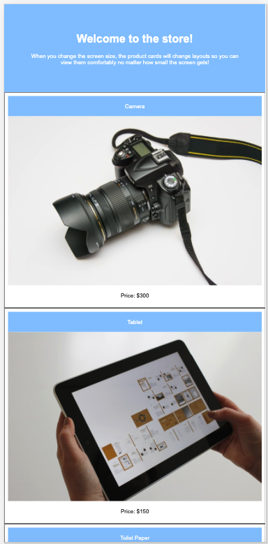

# 🏗️ Implement Media Queries for Screens

Work with a partner to implement the following user story:

* As an online shopper, I want to view products clearly on my mobile phone as well as my computer.

## Acceptance Criteria

* It's done when the screen size is larger than 992px and the product cards on the screen are side by side.

* It's done when I change the screen size to 992px or smaller, and the product cards on the screen split into two columns.

* It's done when I change the screen size to 768px or smaller, and the product cards on the screen become stacked on top of each other.

* Optional: Just for fun, change the background color of the header each time the product cards change layout. 

## Assets

The following image demonstrates the web application's appearance at 992px or smaller:

The following image demonstrates the web application's appearance at 768px or smaller:

---

## 💡 Hints

* What is the media feature we use to check for the maximum width of the display area?

## 🏆 Bonus

If you have completed the activity and want to further your knowledge, work through the following challenge with your partner:

  * What is mobile-first design?

Use [Google](https://www.google.com) or another search engine to research this.

---
© 2021 Trilogy Education Services, LLC, a 2U, Inc. brand. Confidential and Proprietary. All Rights Reserved.