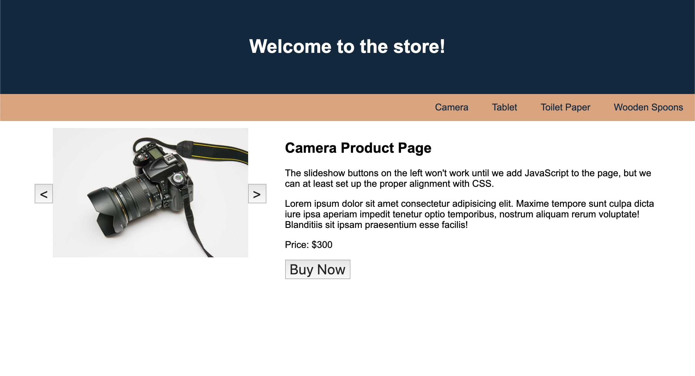

# 🐛 Link and Button Placement is Incorrect

Work with a partner to resolve the following issues:

* As a user, I want the navigation links to be on the right side.

* As a user, I want the slideshow buttons to be sized as smaller icons and centered alongside the image.

## Expected Behavior

The navigation links are aligned to the right. The slideshow buttons are smaller than the image and are centered alongside the image.

## Actual Behavior

The navigation links are aligned to the left. The slideshow buttons extend to the same height as the image.

## Assets

The following image demonstrates the web application's appearance:

---

## 💡 Hints

* What are some of the other possible values for flexbox's alignment and justification properties?

## 🏆 Bonus

If you have completed the activity and want to further your knowledge, work through the following challenge with your partner:

* What e-commerce websites can you find that are using flexbox properties to help organize their components and layouts?

Use [Google](https://www.google.com) or another search engine to research this.

---
© 2021 Trilogy Education Services, LLC, a 2U, Inc. brand. Confidential and Proprietary. All Rights Reserved.