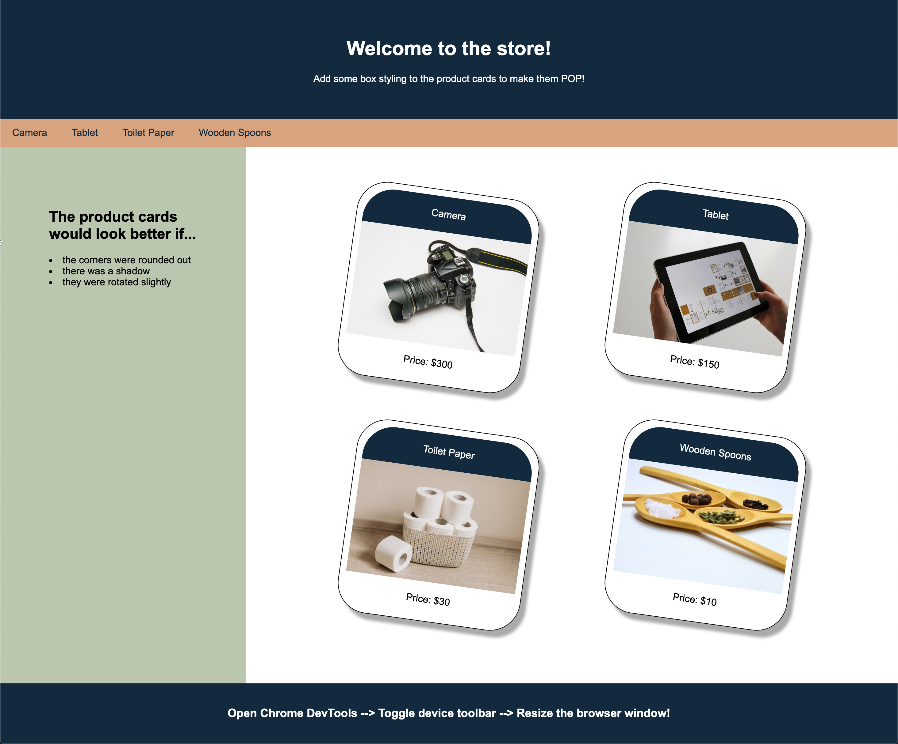

# 📖 Implement Box Styling on Product Cards

Work with a partner to implement the following user stories:

* As the store owner, I want to display the product cards with rounded corners.

* As the store owner, I want to give the product cards a 3D look by dropping a shadow and rotating it slightly.

## Acceptance Criteria

* It's done when the product cards have rounded corners, drop shadows, and a rotated appearance.

* The solution does not have to look exactly like the image provided. Play around with the properties and have fun!

## 📝 Notes

Refer to the following documentation:

[MDN Web Docs on creating fancy boxes](https://developer.mozilla.org/en-US/docs/Learn/CSS/Howto/create_fancy_boxes)

## Assets

The following image demonstrates the web application's appearance:

---

## 💡 Hints

* Look into CSS border and background properties, like `border-radius`, `box-shadow`, and `transform`.

## 🏆 Bonus

If you have completed the activity and want to further your knowledge, work through the following challenge with your partner:

* What are vendor prefixes, and how are they useful?

Use [Google](https://www.google.com) or another search engine to research this.

---
© 2021 Trilogy Education Services, LLC, a 2U, Inc. brand. Confidential and Proprietary. All Rights Reserved.