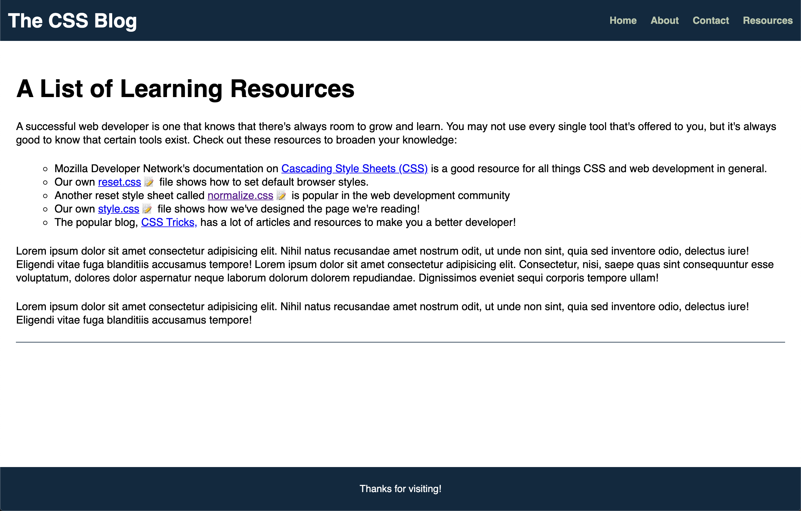

# 📖 Implement an Icon for Downloadable Style Sheets

Work with a partner to implement the following user story:

* As a user, I want to see an icon next to every `<a>` element that has a link to a downloadable CSS file in its `href` attribute.

## Acceptance Criteria

* It's done when any link to a CSS file displays a 📝 emoji after the link text.

* It's done when the 📝 emoji is inserted using only CSS.

## 📝 Notes

Refer to the following documentation: 

[MDN Web Docs on attribute selectors](https://developer.mozilla.org/en-US/docs/Web/CSS/Attribute_selectors)

## Assets

The following image demonstrates the web application's appearance:

---

## 💡 Hints

* How can you target a file type by its file extension (i.e., `.css`, `.html`, `.md`, etc.)?

* How can you use pseudo-elements to accomplish this task?

## 🏆 Bonus

If you have completed the activity and want to further your knowledge, work through the following challenge with your partner:

* How do selectors affect CSS performance?

Use [Google](https://www.google.com) or another search engine to research this.

---
© 2021 Trilogy Education Services, LLC, a 2U, Inc. brand. Confidential and Proprietary. All Rights Reserved.