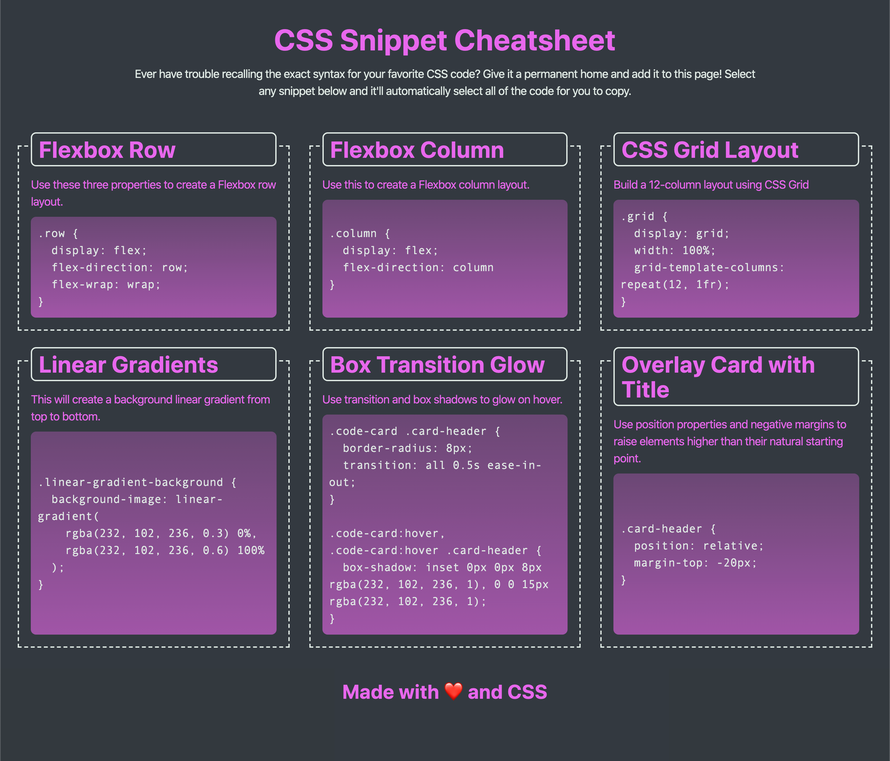
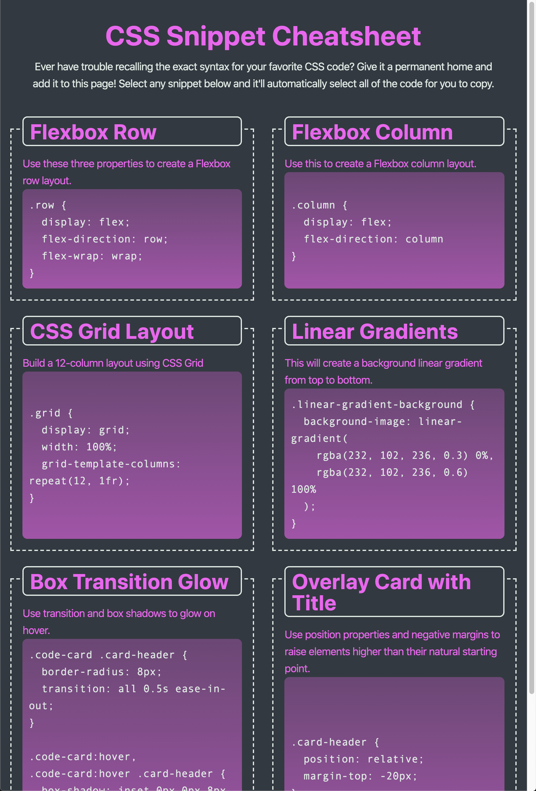
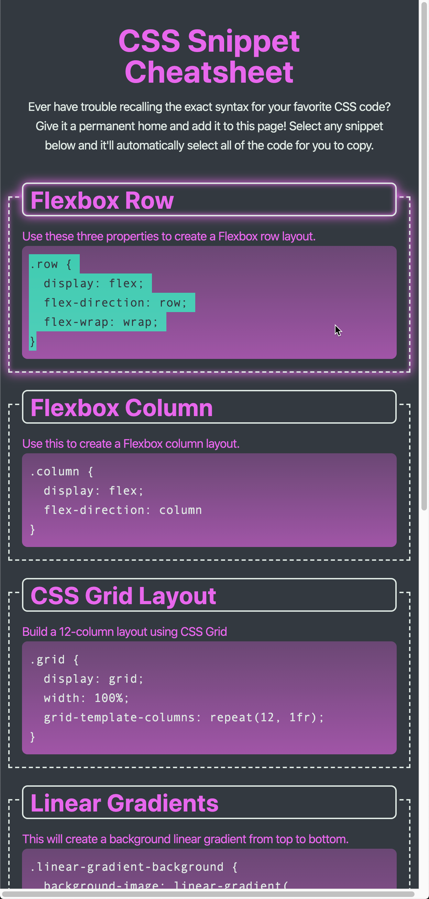

# Unit 02 Mini-Project: CSS Snippet Cheat Sheet

In this activity, you will work with a group to build a webpage that will hold a collection of CSS snippets. What better way to learn CSS than to build a knowledge base of CSS?

## Instructions

The completed application should meet the following criteria:

* As a user, I can view a collection of labeled CSS snippets in a responsive grid.

* As a user, I can easily identify these CSS snippets by their headings.

* As a user, I can highlight a code snippet by clicking on it.

* As a user, I can view my application on a mobile device as well as a desktop.

### Specifications

* Must use semantic HTML elements and proper indentation.

* Use CSS variables to maintain clean and reusable values for a color scheme.

* Use flexbox and media queries to create a responsive grid layout.

* Each CSS snippet should have a card-like layout with the CSS syntax wrapped in an [HTML pre element](https://developer.mozilla.org/en-US/docs/Web/HTML/Element/pre).

* Each CSS snippet can easily be highlighted for copying on click using the [CSS user-select property](https://developer.mozilla.org/en-US/docs/Web/CSS/user-select).

* Must incorporate a background color using a [CSS linear-gradient function](https://developer.mozilla.org/en-US/docs/Web/CSS/linear-gradient).

* Must incorporate a bit of animation using the [CSS transition property](https://developer.mozilla.org/en-US/docs/Web/CSS/transition).

* You and your group can decide which CSS styles and colors you will use to design the application, but the app needs to be a responsive. Use the following images to gain an understanding of how the app should look at different screen sizes, from a layout perspective:

  * At size 992px and above, the app should resemble the following image:

    

  * At size 768px and above, the app should resemble the following image:

    

  * On mobile devices, anything under 768px, the app should resemble the following image:

    

## 💡 Hints

* The HTML `<pre>` element is very literal about spaces and indentation. To gain a better understanding of how to work with it, check out this article on [considerations for styling the pre tag](https://css-tricks.com/considerations-styling-pre-tag/).

## 🏆 Bonus

* Set this project up in your own GitHub repositories so that you can deploy and use it for future reference!

---
© 2021 Trilogy Education Services, LLC, a 2U, Inc. brand. Confidential and Proprietary. All Rights Reserved.